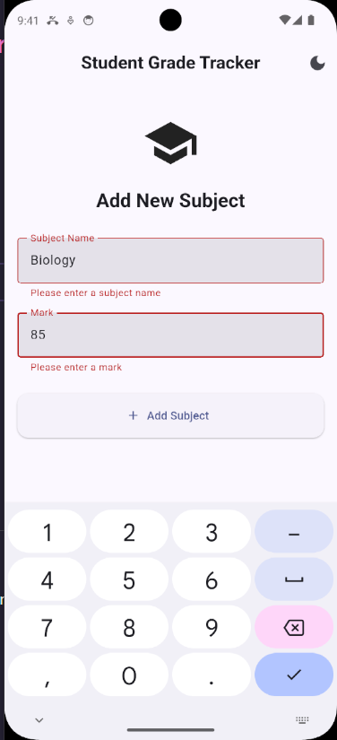
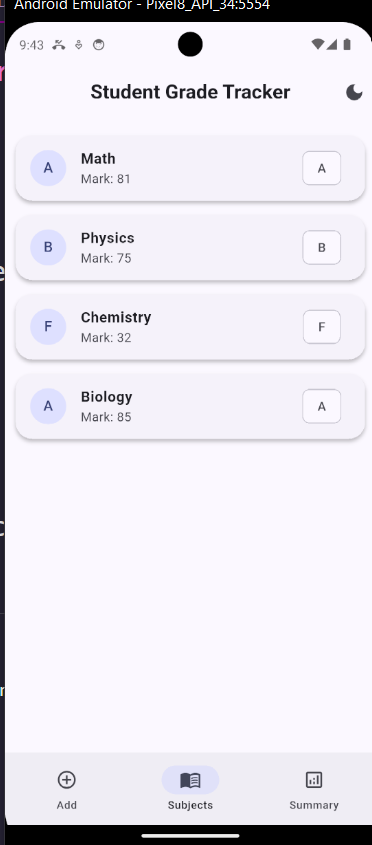
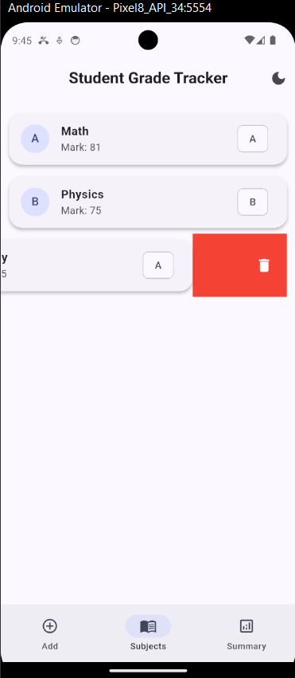
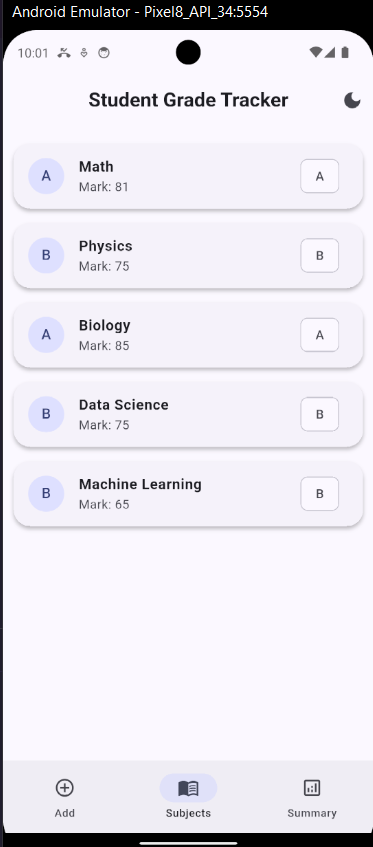
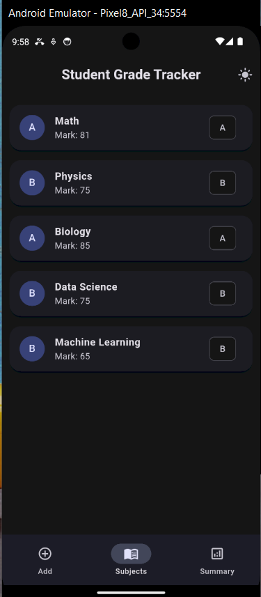

# 📚 Student Grade Tracker

A Flutter application for managing student subjects and grades using **Provider** for state management. The app allows users to add subjects with marks, view all subjects, calculate overall performance, and switch between light and dark themes.


## ✨ Features

* ➕ Add a new subject with marks
* ✅ Form validation

  * Subject name cannot be empty
  * Marks must be between **0–100**
* 📋 View all added subjects
* 🗑️ Delete subjects using **Dismissible**
* 📊 Summary screen displaying:

  * Total Subjects
  * Average Mark
  * Overall Grade
* 🌙 Light/Dark Theme Toggle
* 🔄 State management using **Provider**
* 📱 Responsive Material 3 UI
* 🚫 No `setState()` used for application state


## 📸 Screens

### 1. Add Subject

* Enter subject name


* Enter marks
* Validate inputs
* Add subject

### 2. Subject List

* Displays all added subjects
* Shows:

  * Subject Name
  * Marks
  * Grade


* Swipe to delete a subject


### 3. Summary

* Total number of subjects
* Average marks
* Overall grade


## 4. Dark Mode

Light mode

Dark Mode


## 🏗️ Project Structure

lib/
│
├── models/
│   └── subject.dart
│
├── providers/
│   ├── navigation_provider.dart
│   ├── subject_provider.dart
│   └── theme_provider.dart
│
├── screens/
│   ├── add_subject_screen.dart
│   ├── home_screen.dart
│   ├── subject_list_screen.dart
│   └── summary_screen.dart
│
├── themes/
│   └── app_theme.dart
│
└── main.dart

## 🛠️ Technologies Used

* Flutter
* Dart
* Provider (State Management)
* Material 3 Design

## 📦 Dependencies

```yaml
provider: ^6.1.5
```


## 🚀 Getting Started

### Prerequisites

* Flutter SDK
* Dart SDK
* Android Studio or VS Code
* Android Emulator or Physical Device

### Installation

Clone the repository:

git clone https://github.com/MDhossin093/student_grade_tracker.git


Navigate to the project:

cd student_grade_tracker

Install dependencies:

flutter pub get

Run the application:

flutter run


## 📖 Grading System

|    Marks | Grade |
| -------: | :---: |
| 80 – 100 |   A   |
|  65 – 79 |   B   |
|  50 – 64 |   C   |
| Below 50 |   F   |

## 🧠 State Management

The application uses **Provider** for managing:

* Subject list
* Navigation state
* Theme switching

No `setState()` is used for application state updates.


## 🎨 UI Features

* Material 3 Design
* Light & Dark Themes
* Rounded Cards
* Modern Navigation Bar
* Responsive Layout


## 👨‍💻 Author

**MD Hossin**

Department of Computer Science and Engineering
Comilla University

## 📄 License

This project was developed for academic purposes as part of a Flutter application development assignment.
